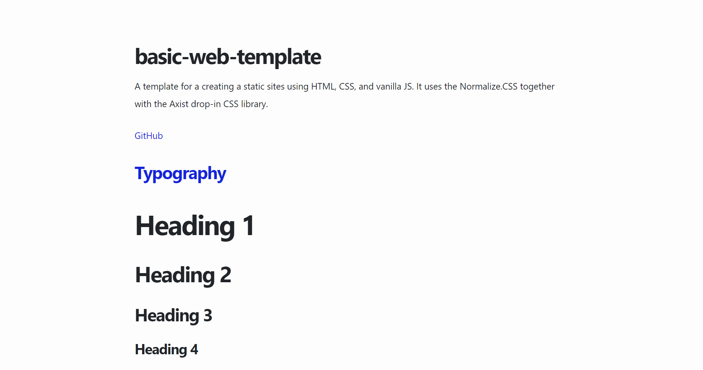

# 🎭 web-project-template
[](https://github.com/thedaviddias/Front-End-Checklist/)


A template for a creating a static sites using HTML, CSS, and vanilla JS. 



[▶ Live Preview](https://creme332.github.io/basic-web-template/)

## 🚀 Features
- Uses Normalize.css to avoid browser inconsistencies.
- Uses the Axist drop-in CSS library for a beautiful CSS out the box.

## ⛱ Usage
Use this space to show useful examples of how a project can be used. Additional screenshots, code examples and demos work well in this space. You may also link to more resources.

## 🛠 Installation
Click on the `Use this template` option:


Alternatively, you can clone the repository locally with Git:
```bash
git clone git@github.com:creme332/my-odin-projects.git
```
## 📌 Attributions
| Resource                  | Source                                  |
| ------------------------- | --------------------------------------- |
| Drop-in Axist CSS library | https://github.com/ruanmartinelli/axist |

## 🔨 To-Do
- [ ] Follow frontend checklist

### ✔ Done
